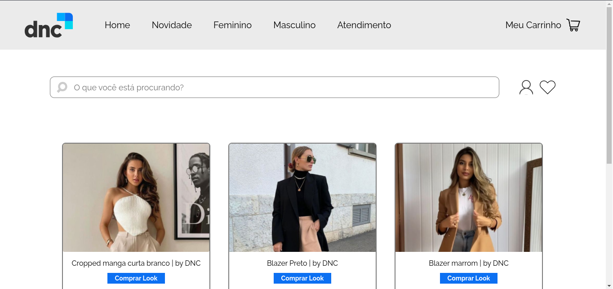

<h1 align="center"> E-COMMERCE </h1>

<p align="center">
O projeto e-commerce tem base descorrer funcionalidades de React + Vite para fixação de conteúdo do curso de FullStack Developer da escola DNC. <br/>
</p>

<p align="center">
  <a href="#funcionalidades">Funcionalidades</a>&nbsp;&nbsp;&nbsp;|&nbsp;&nbsp;&nbsp;
  <a href="#demonstração">Demonstração</a>&nbsp;&nbsp;&nbsp;|&nbsp;&nbsp;&nbsp;
  <a href="#rodando-localmente">Rodando Localmente</a>&nbsp;&nbsp;&nbsp;|&nbsp;&nbsp;&nbsp;
  <a href="#🛠-tecnologias">Tecnologias</a>
</p>

<p align="center">
  
</p>

<p align="center">
  
</p>

#### Funcionalidades

- Componentes Dinâmicos
- Telas Dinâmicos

## Demonstração


## 🛠 Tecnologias

 
 
 
 
 


## Rodando localmente

Clone o projeto

```bash
  git clone https://github.com/felipedestro/dnc-ecommerce.git
```

Entre no diretório do projeto

```bash
  cd e-commerce
```

Instale as dependências

```bash
  npm install
```

Inicie o servidor

```bash
  npm run dev
```

---

Feito por Felipe Destro 👋 [Conheça meus projetos!](hhttps://github.com/felipedestro)
